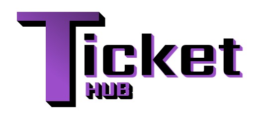

# Ticket Hub - Aplicación Web para peticiones Helpdesk



## Descripción
Este proyecto es una aplicación web diseñada para crear gestionar solicitudes de helpdesk de los usuarios. Proporciona una interfaz intuitiva y amigable para que los usuarios puedan crear tickets y un administrador pueda gestionarlos. La aplicación utiliza una arquitectura de desarrollo basada en [PHP](https://www.php.net/manual/es/intro-whatis.php) MVC (Modelo-Vista-Controlador) y POO (Programación Orientada a Objetos). Además, hace uso de MySQL como base de datos para almacenar y gestionar la información, y utiliza JavaScript para mejorar la interactividad del sitio. El diseño visual está basado en el framework CSS [Milligram](https://milligram.io/).

## Características Principales
- Login y Registro de Usuarios
- Panel Dashboard para Administradores
- Creacion de Tickets
- Sistema de respuestas para tickets
- Sistema de notificaciones para tickets (en desarrollo)
- Sistema de búsqueda de tickets (en desarrollo)


## Tecnologías Utilizadas

<p align="center">
  
  
  
  
</p>

- **PHP**: Lenguaje de programación utilizado para desarrollar el backend de la aplicación.
- **MVC**: Arquitectura de desarrollo que separa la lógica de la aplicación en tres componentes principales: Modelo, Vista y Controlador.
- **POO**: Programación Orientada a Objetos es un paradigma de programación utilizado en el desarrollo de la aplicación para mejorar la modularidad y reutilización de código.
- **MySQL**: Sistema de gestión de bases de datos relacional utilizado para almacenar y administrar los datos de la aplicación.
- **JavaScript**: Lenguaje de programación utilizado para mejorar la interactividad y dinamismo en el lado del cliente.
- **Milligram.css**: Framework CSS minimalista y ligero utilizado para estilizar la interfaz de usuario de la aplicación.
- **Docker**: Plataforma de contenedores que facilita la creación y ejecución de aplicaciones en entornos aislados y reproducibles.
- **Docker Compose**: Herramienta para definir y ejecutar múltiples contenedores Docker como un servicio.
- **phpMyAdmin**: Herramienta de administración de bases de datos MySQL basada en web para facilitar la gestión de la base de datos.

## Requisitos del Sistema
- Docker
- Docker Compose

## Instalación
1. Clona el repositorio en tu máquina local:
   ```
   git clone https://github.com/JuanelopS/Ticket-Hub.git
   ```

2. Navega hasta la carpeta del proyecto:
   ```
   cd Ticket-Hub
   ```

3. Construye y ejecuta los contenedores Docker-compose:
   ```
   docker-compose up -d --build
   ```

4. Importa la estructura de la base de datos (puedes usar phpmydamin también):
   ```
    docker exec -i mysql mysql -uroot -proot < dump.sql
   ```

5. Crea un archivo de configuración para la conexión a la base de datos:
   ```
   cp config/constants.example.php config/constants.php
   ```

6. Abre un navegador web y accede a `http://localhost` para acceder a tu aplicación web. Para acceder a phpMyAdmin, visita `http://localhost:8000` y utiliza las credenciales proporcionadas anteriormente.

## Estructura de Archivos (MVC) - Carpeta www
- `index.php`: Punto de entrada de la aplicación.
- `config/constants.php`: Archivo de configuración para la conexión a la base de datos.
- `config/router.php`: Simple router (http://localhost/controlador/funcion/parametro)
- `controllers/`: Carpeta que contiene los controladores de la aplicación.
- `models/`: Carpeta que contiene los modelos de la aplicación.
- `views/`: Carpeta que contiene las vistas de la aplicación.
- `assets/`: Carpeta que contiene los archivos estáticos (CSS, JS, imágenes, etc.).
- `dump.sql`: Archivo SQL para importar la estructura de la base de datos.
- `Dockerfile`: Archivo de configuración para construir la imagen del contenedor Docker.
- `docker-compose.yml`: Archivo de configuración para definir los servicios y su interacción en Docker Compose.

